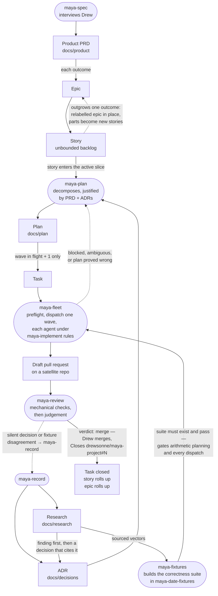

# maya-project

Project management hub for the Maya dates project (ADR 0010): all issues,
decisions, product docs, plans, research — and the project's Claude Code
skills, served from this repo as a plugin marketplace.

## Install the skills

```
/plugin marketplace add drewsonne/maya-project
/plugin install maya@maya-project
```

Skills are then invocable anywhere, namespaced: `/maya:maya-orient`,
`/maya:maya-plan`, and so on. See `plugins/maya/skills/README.md` for what
each does and how they chain. Skills change only via a commit here plus a
version bump in `plugins/maya/.claude-plugin/plugin.json`.

## The artifacts, and how work flows between them

Seven kinds of artifact. Four live as files in this repo, three as issues.

| artifact | lives in | what it is | written by |
|---|---|---|---|
| **Research** | `docs/research/` | A sourced fact about the world — a published date pair, a convention in the literature, a disagreement between authors. Never a choice. | `maya-record` |
| **ADR** | `docs/decisions/` | A choice that constrains the code, made by Drew. Numbered, never rewritten — superseded by a later ADR. | `maya-record` |
| **Product** | `docs/product/` | The PRD: who the product is for and what it must get right. Outcomes, never technologies. | `maya-spec` (interview) |
| **Plan** | `docs/plan/` | Waves of work packages decomposed from stories — scope, contract, criteria, fixtures per package. | `maya-plan` |
| **Epic** | issue, label `epic` | A PRD outcome, long-lived. Few. Carries stories, never tasks directly. | `maya-plan` / by hand |
| **Story** | issue, label `story`, sub-issue of an epic | One outcome with acceptance criteria. The backlog — unbounded (ADR 0011). | anyone, any time |
| **Task** | issue, type `Task`, sub-issue of a story | One work package verbatim: one agent, one branch, one PR. Just-in-time only. | `maya-plan` |

Every skill acts at exactly one place in this flow — skills are the verbs,
artifacts are the nouns. `maya-orient` is the exception: it reads everything
and writes nothing (run it at session start).



Rounded nodes are skills; rectangles are artifacts. Not shown:
`maya-orient` (reads all of it), and `maya-implement`, which is not a step
but the rulebook every dispatched agent — and every hand-made change —
works under between dispatch and PR.

### Movement rules

- **Research → ADR.** When the literature says X and we therefore do Y,
  the finding is written first and the decision cites it — never merged
  into one document (`maya-record`).
- **Product → Epic.** Epics trace to PRD outcomes. A feature idea with no
  PRD outcome behind it prompts a `maya-spec` round, not a stealth epic.
- **Epic → Story.** Stories are created freely, at any time, for any
  future work (ADR 0011). Capturing an idea costs one issue; nothing worth
  doing lives only in a conversation.
- **Story → Epic (promotion).** A story that needs more than one coherent
  outcome is relabelled `epic` on the same issue; its parts become new
  stories beneath it. Demotion is the same move in reverse. Epics are
  earned from evidence of complexity, never guessed up front.
- **Story → Plan → Task.** When a story enters the active slice,
  `maya-plan` decomposes it into packages, each justified by the PRD or an
  ADR. Tasks exist for the wave in flight plus at most one planned ahead
  (ADR 0009); a queued wave is re-validated against `main` before dispatch.
  Decomposition is cheap to regenerate — a task inventory is a liability.
- **Task → PR → closed.** One task, one branch, one draft PR on the repo
  that owns the code, closing its task with the full cross-repo form
  (`Closes drewsonne/maya-project#N`). `maya-review` gates the merge; Drew
  merges.
- **Anything → Research/ADR (findings loop).** A fixture disagreement, a
  silent decision discovered in review, or a blocked package is a finding.
  It flows back through `maya-record` — the fixture is never edited to
  resolve it, and a planning error is fixed in the plan, not negotiated
  with the implementation.

## Layout

- `STATE.md` — where things stand; start here.
- `docs/decisions/` — numbered ADRs. 0009: the issue model. 0010: this
  repo. 0011: stories as the unbounded backlog.
- `docs/product/` — the PRD and non-goals.
- `docs/plan/` — dependency-ordered work-package waves.
- `docs/research/` — sourced findings.
- `plugins/maya/skills/` — the eight skills (the `maya` plugin).

## The repos

- [`maya-date-fixtures`](https://github.com/drewsonne/maya-date-fixtures) — citation-backed correctness vectors (the dataset).
- [`maya-dates`](https://github.com/drewsonne/maya-dates) — the conversion library.
- [`maya-calculator-parser`](https://github.com/drewsonne/maya-calculator-parser) — date-expression parser.
- [`maya-calculator`](https://github.com/drewsonne/maya-calculator) — the app.
